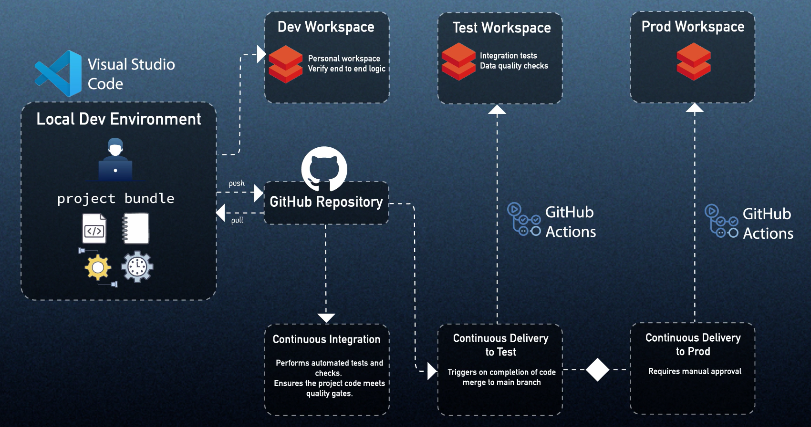

# Project README

## 📌 Introduction

This project demonstrates a complete **end-to-end Data Engineering workflow on Azure Databricks**, covering development, testing, validation, and automated CI/CD deployments using **Databricks Asset Bundles (DAB)** and **GitHub Actions**.

It includes:
- Multi-environment setup (Dev, Test, Prod)
- Notebook & Python script orchestration
- Delta Live Tables (DLT)
- Python wheel packaging
- Automated validation framework
- Unit testing & coverage enforcement
- CI/CD-driven deployments to Test and Prod

This serves as a reference architecture for scalable and production-ready Databricks projects.

---

## ✅ What Are The Features Done So Far

---

## 🏗️ Environment & Setup

1. Created **three Azure Databricks workspaces** (dev, test, prod)
2. Configured **VS Code** for Databricks development
3. Installed and configured **Databricks CLI**
4. Set up **Databricks Connect** for IDE-driven local execution

---

## 📒 Notebook Tasks and Variables with DAB

1. Configured, deployed, and executed **ETL jobs** using DAB
2. Implemented **regular variables with manual override**
3. Added **regular variables with target override**
4. Worked with **complex variables** for advanced configurations

---

## 🐍 Python Script Tasks with DAB

1. Implemented Python script tasks with **parameter handling** through DAB

---

## 🔄 Delta Live Table (DLT) Pipelines with DAB

1. Developed **DLT pipeline source notebooks**
2. Configured and deployed **DLT pipelines** using DAB

---

## 📦 Working with Python Wheel

1. Created a **Python wheel (.whl)** package
2. Installed wheel packages on Databricks clusters/jobs
3. Added **Python Wheel Task** for production workflows

---

## 🧪 Modularized Validation Script

### Implemented `validation_config.yaml` with:

1. **Table existence check**
2. **Row-count check**
3. **Job existence check**

This supports reusable validation logic for CI and deployments.

---

## 🧑‍💻 Local Development and Unit Testing

1. Added **PyTest** for unit and integration tests
2. Enabled running tests via **CI** and/or **Databricks Connect**
3. Generated **coverage reports** to maintain quality
4. Configured CI to **fail pipeline if coverage < 80%**

---

## 🚀 End-to-End CI/CD Workflows with DAB & GitHub

1. Onboarded the project to **Git**
2. Adopted **branch-based workflows**
3. Implemented **Databricks Service Principal Setup** for Test & Prod deployments
4. Integrated **GitHub Actions** to automate:
   - Build
   - Test
   - Staging deployment (with approval)
   - Production rollout

---

## 🏗️ High-Level Architecture



You'll also want to set up local Python environments for Databricks Connect and local PySpark development. Follow the instructions for your platform below.

### Virtual Environment Setup

#### macOS / Linux

1. **Create and activate the Databricks Connect environment (using Python 3.11)**
   ```bash
   # at the project root
   python3.11 -m venv .venv_dbc
   source .venv_dbc/bin/activate
   ```
2. **Install Databricks Connect dependencies**
   ```bash
   pip install -r requirements-dbc.txt
   ```
3. **Verify installation**
   ```bash
   pip list
   deactivate
   ```

#### Windows

1. **Create and activate the Databricks Connect environment (using Python 3.11)**
   ```powershell
   # at the project root
   py -3.11 -m venv .venv_dbc
   .\.venv_dbc\Scripts\activate
   ```
2. **Install Databricks Connect dependencies**
   ```powershell
   pip install -r requirements-dbc.txt
   ```
3. **Verify installation**
   ```powershell
   pip list
   deactivate
   ```

---

You will also need to update the `databricks.yml` configuration file with your Workspace URLs and Service Principal details.

### Databricks CLI, Set-Up and Bundle Commands

1. Install the Databricks CLI
   ```bash
   curl -fsSL https://raw.githubusercontent.com/databricks/setup-cli/main/install.sh | sh
   ```
   or alternatively on a MacOS if you need admin override
   ```bash
   sudo curl -fsSL https://raw.githubusercontent.com/databricks/setup-cli/main/install.sh | sudo sh
   ```

2. Install Git


   You need Git to clone the repository or reference it during bundle initialization.
   
    ```bash
    Install Git: https://git-scm.com/downloads
    ```

2. Authenticate to your Databricks workspace, if you have not done so already:
    ```bash
    databricks configure
    ```

3. To deploy a development copy of this project, type:
    ```bash
    databricks bundle deploy --target dev
    ```
    (Note that "dev" is the default target, so the `--target` parameter
    is optional here.)

    This deploys everything that's defined for this project.
    For example, the default template would deploy a job called
    `[dev yourname] dab_project_job` to your workspace.
    You can find that job by opening your workspace and clicking on **Workflows**.

4. Similarly, to deploy a production copy, type:
   ```bash
   databricks bundle deploy --target prod
   ```

   Note that the default job from the template has a schedule that runs every day
   (defined in resources/dab_project.job.yml). The schedule
   is paused when deploying in development mode (see
   https://docs.databricks.com/dev-tools/bundles/deployment-modes.html).

5. To run a job or pipeline, use the "run" command:
   ```bash
   databricks bundle run
   ```

6. Optionally, install developer tools such as the Databricks extension for Visual Studio Code from
   https://docs.databricks.com/dev-tools/vscode-ext.html.

7. For documentation on the Databricks asset bundles format used
   for this project, and for CI/CD configuration, see https://docs.databricks.com/dev-tools/bundles/index.html.

For any doubt please connect with me on this mail id amiya.rout@publicissapient.com

